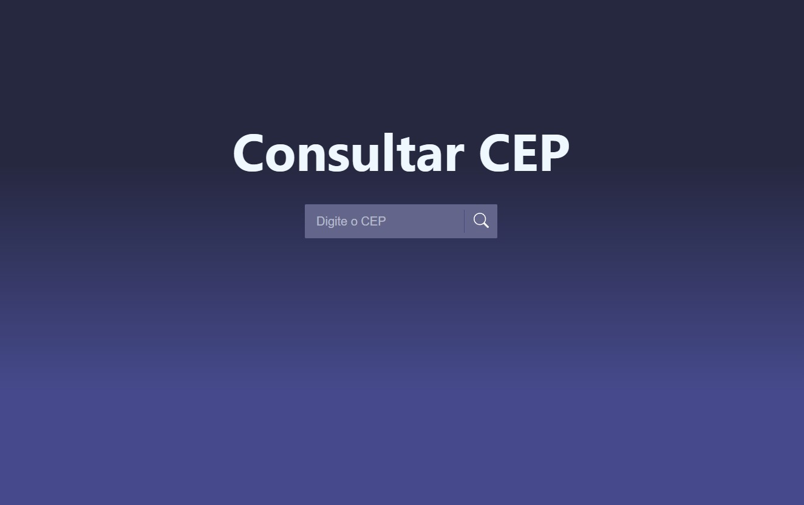

<h1 align="center">Buscador de Cep</h1>

  <a href="#-tecnologias">Tecnologias</a>&nbsp;&nbsp;&nbsp;|&nbsp;&nbsp;&nbsp;
  <a href="#-projeto">Projeto</a>&nbsp;&nbsp;&nbsp;|&nbsp;&nbsp;&nbsp;
  <a href="#-link-do-projeto">Link do Projeto</a>&nbsp;&nbsp;&nbsp;|&nbsp;&nbsp;&nbsp;
  <a href="#-licença">Licença</a>

  

 

  

## ✨ Tecnologias

Esse projeto foi desenvolvido com as seguintes tecnologias:

- React
- JavaScript
- CSS
- Axios

## 💻 Projeto

O Buscador faz uso da API gratuita [Via Cep](https://viacep.com.br) para pesquisar o CEP desejado!

Para executar o projeto na sua máquina, baixe ou clone o repositório e execute o comando:

### `npm start`

Abra [http://localhost:3000](http://localhost:3000) em seu navegador.

## 🚀 Link do Projeto

https://reactbuscacep.netlify.app

## 📄 Licença

Esse projeto está sob a licença MIT. Veja o arquivo [LICENSE](LICENSE.md) para mais detalhes.

---

Feito com ♥ by Samuel 👋🏻 [Veja outros projetos!](https://github.com/samuelsilvati?tab=repositories)
